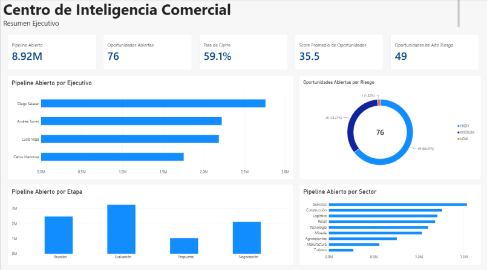
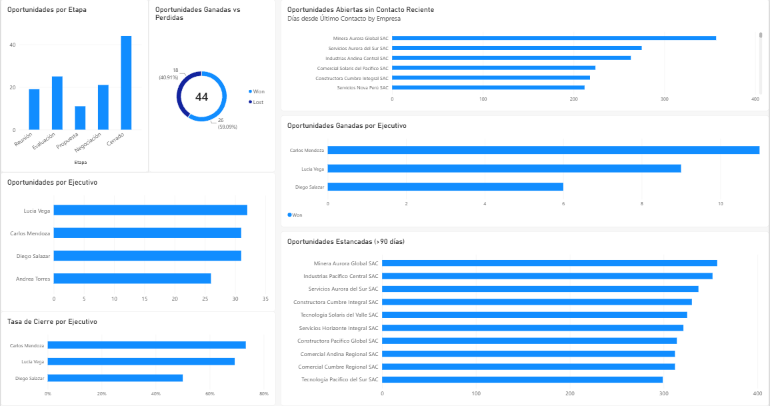
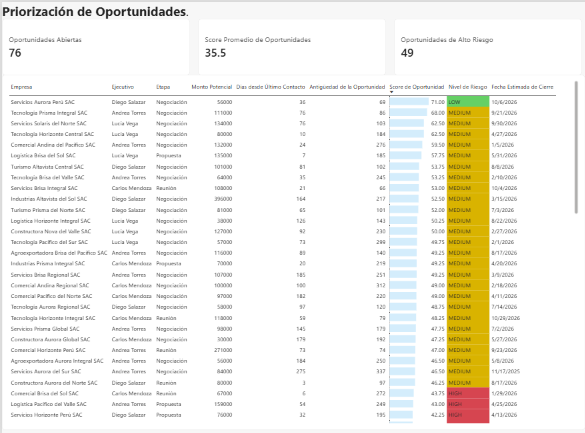

# Commercial Intelligence Hub

Dashboard de inteligencia comercial en Power BI para analizar oportunidades, desempeño por ejecutivo y prioridades de seguimiento. El caso simula una empresa de inversiones y utiliza datos ficticios generados con Python.

## Problema y análisis

Un equipo comercial necesita conocer el monto de sus oportunidades abiertas, comparar resultados por ejecutivo e identificar negocios que requieren seguimiento. El proyecto combina generación de datos, validaciones y un puntaje determinístico con tres páginas de análisis.

| Página | Contenido |
| --- | --- |
| Resumen Ejecutivo | Pipeline abierto, oportunidades abiertas, tasa de cierre, puntaje promedio y riesgo; desglose por ejecutivo, etapa y sector. |
| Embudo Comercial y Desempeño | Distribución por etapas, resultados ganados y perdidos, tasa de cierre por ejecutivo y seguimiento de oportunidades estancadas. |
| Priorización de Oportunidades | Tabla de oportunidades abiertas, ordenada por puntaje, con monto, antigüedad, días sin contacto y nivel de riesgo. |

## Vista del informe

### Resumen Ejecutivo



### Embudo Comercial y Desempeño



### Priorización de Oportunidades



## Datos y método

Los archivos fuente contienen 250 leads, 120 oportunidades y 400 actividades. La salida conserva una fila por oportunidad y añade atributos del lead, métricas de tiempo, seis componentes de puntuación y nivel de riesgo. El corte de evaluación es el **21 de septiembre de 2026**.

El puntaje de 0 a 100 aplica reglas sobre etapa, probabilidad registrada, contacto reciente, antigüedad, monto y cierre esperado. Permite ordenar oportunidades para revisar su seguimiento. [Consultar las reglas](docs/scoring.md).

## Tecnologías

- Power BI: informe de tres páginas y visualizaciones comerciales.
- DAX: medidas referenciadas por el informe, como `Open Pipeline`, `Open Opportunities` y `Win Rate`.
- Python: generación reproducible, procesamiento y validación mediante la biblioteca estándar.
- CSV: datos fuente y dataset enriquecido.

## Explorar el proyecto

1. Descargar o clonar el repositorio completo.
2. Abrir `powerbi/Commercial_Intelligence_Hub_Espanol.pbix` en Power BI Desktop.
3. Recorrer las tres páginas y revisar la priorización de oportunidades abiertas.
4. Para actualizar desde el CSV incluido, revisar el origen de `commercial_dataset` en Power Query y seleccionar `output/commercial_dataset.csv` de la copia local. [Consultar apertura y validación](docs/powerbi.md).

Para recalcular el dataset existente desde la raíz del proyecto:

```powershell
python scripts/calculate_scores.py
```

Para regenerar las fuentes con los parámetros originales y luego recalcular:

```powershell
python scripts/generate_data.py --as-of 2026-09-21 --seed 42
python scripts/calculate_scores.py
```

El generador sobrescribe los tres CSV de `data/`. El cálculo sobrescribe únicamente `output/commercial_dataset.csv`. No se necesitan paquetes externos para esos scripts.

## Alcance

Es una demo de portafolio con datos ficticios. El puntaje usa reglas determinísticas y no es una probabilidad predictiva. Para analizar riesgo activo se filtra `result = Open`, ya que las oportunidades cerradas tienen reglas especiales de puntuación. Salesforce no está integrado en esta versión.

La revisión reprodujo el dataset puntuado y contrastó las tres capturas con sus datos. Se verificó en el archivo guardado que el gráfico de contacto pendiente filtra oportunidades abiertas con más de 30 días sin contacto, y que la página de priorización filtra oportunidades abiertas. [Resultados y alcance de la verificación](docs/verification.md).

## Estructura y documentación

```text
data/       Fuentes ficticias: leads, oportunidades y actividades
scripts/    Generación y cálculo de puntajes
output/     Dataset enriquecido utilizado por el informe
powerbi/    Informe en español
docs/       Diccionario, metodología y verificación
screenshots/ Capturas de las tres páginas
```

- [Diccionario de datos](docs/data_dictionary.md)
- [Reglas de puntuación](docs/scoring.md)
- [Apertura y revisión en Power BI](docs/powerbi.md)
- [Resultados de verificación](docs/verification.md)
